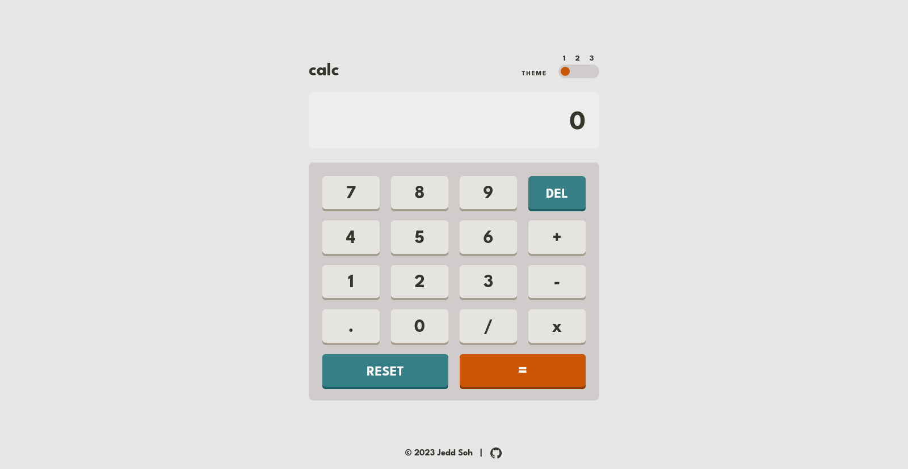

# Frontend Mentor - Calculator app solution

## Table of contents

- [Overview](#overview)
  - [The challenge](#the-challenge)
  - [Screenshot](#screenshot)
  - [Links](#links)
- [My process](#my-process)
  - [Built with](#built-with)
  - [What I learned](#what-i-learned)
  - [Continued development](#continued-development)
  - [Useful resources](#useful-resources)
- [Author](#author)
- [Acknowledgments](#acknowledgments)

## Overview

### The challenge

Users should be able to:

- See the size of the elements adjust based on their device's screen size
- Perform mathematical operations like addition, subtraction, multiplication, and division
- Adjust the color theme based on their preference

### Screenshot



### Links
- Live Site URL: [https://jeddsoh.github.io/calculator/](https://jeddsoh.github.io/calculator/)

## My process

I built this calculator as a learning project while studying software development through [The Odin Project](https://theodinproject.com).

This is also a solution to the [Calculator app challenge on Frontend Mentor](https://www.frontendmentor.io/challenges/calculator-app-9lteq5N29). 

### Built with

- Vanilla JavaScript
- Semantic HTML5 markup
- CSS custom properties
- Flexbox
- CSS Grid
- Mobile-first workflow


### What I learned

Gaining experience with user color theme preferences was invaluable. Moving forward, I plan to implement dark and light themes to my websites.

Writing JavaScript for a calculator app is not as simple as creating some add() ad subtract() functions. If there's a way to break the app, users will find it. I needed to protect against potential breaks in the code. For example, preventing multiple decimal points from being added (which results in NaN), and using booleans to check whether a user is typing an operator or an operator.

```css
:root.light {
  --bg-color: hsl(0, 0%, 90%);
  --text-color: hsl(60, 10%, 19%);
  --screen-color: hsl(0, 0%, 93%);...

  :root.dark {
  --bg-color: hsl(222, 26%, 31%);
  --text-color: hsl(0, 0%, 100%);
  --screen-color: hsl(224, 36%, 15%);...
```
```js
deleteBtn.addEventListener("click", () => {
  if (!operator) {
    let num1Array = num1.split("");
    num1Array.pop();
    num1 = num1Array.join("");

    if (num1.includes(".")) {
      hasPoint = true;
    } else if (!num1.includes(".")) {
      hasPoint = false;
    }
  } else if (operator && num2) {
    let num2Array = num2.split("");
    num2Array.pop();
    num2 = num2Array.join("");

    if (num2.includes(".")) {
      hasPoint = true;
    } else if (!num2.includes(".")) {
      hasPoint = false;
    }
  } else if (operator && !num2) {
    operator = "";
  }

  updateTotal();

  if (!num1) {
    displayTotal.textContent = "0";
  }
});deleteBtn.addEventListener("click", () => {
  if (!operator) {
    let num1Array = num1.split("");
    num1Array.pop();
    num1 = num1Array.join("");

    if (num1.includes(".")) {
      hasPoint = true;
    } else if (!num1.includes(".")) {
      hasPoint = false;
    }
  } else if (operator && num2) {
    let num2Array = num2.split("");
    num2Array.pop();
    num2 = num2Array.join("");

    if (num2.includes(".")) {
      hasPoint = true;
    } else if (!num2.includes(".")) {
      hasPoint = false;
    }
  } else if (operator && !num2) {
    operator = "";
  }

  updateTotal();

  if (!num1) {
    displayTotal.textContent = "0";
  }
});
```

### Continued development

Although I've marked this project complete, these are some features I'd add if I continued working on it:
- A log of past calculations
- Smoother animations
- More calculations, such as exponents and parenthesis

## Acknowledgments

Thanks to the Odin Project and Frontend Mentor.